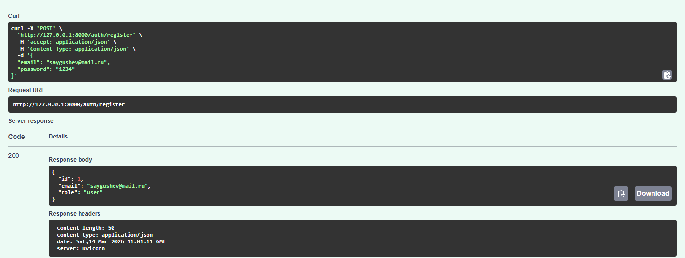
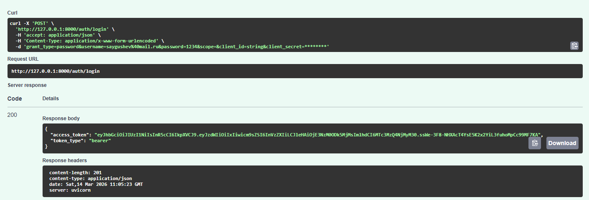
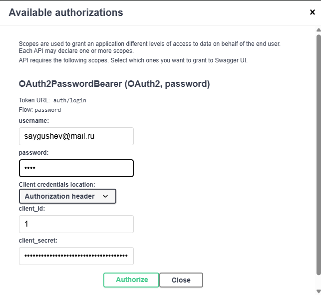
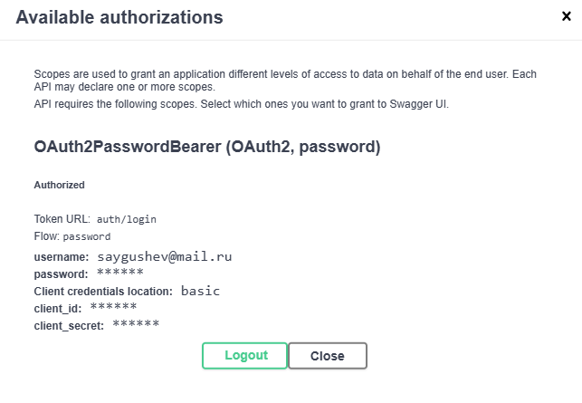
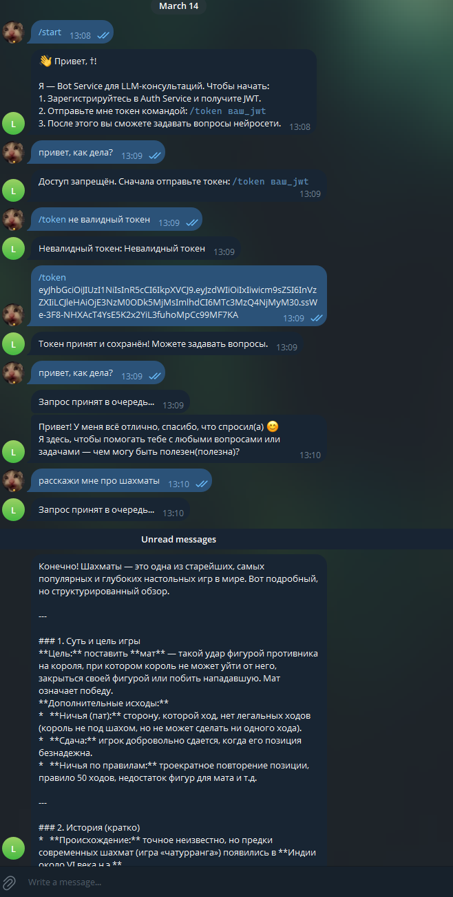
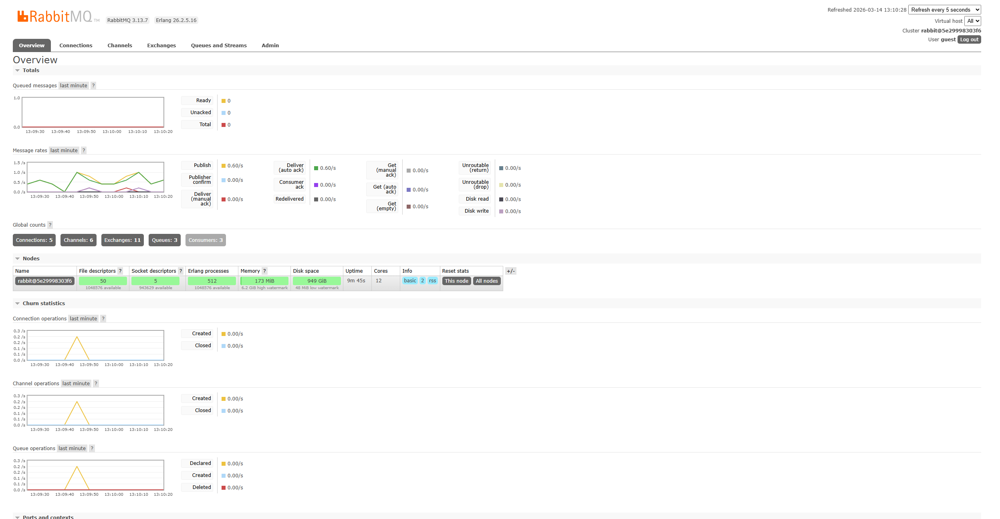
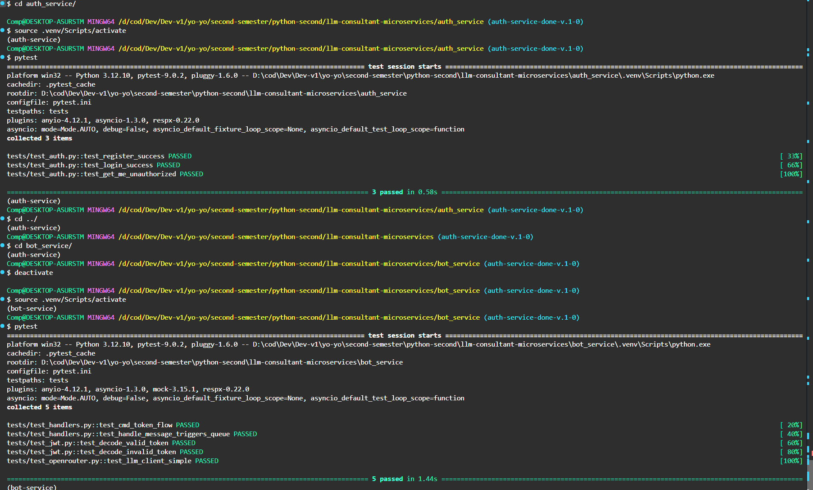

# llm-consultant-microservices

# llm-consultant-microservices_Saygushev_M25-555

**LLM consultant microservices** — это производительный асинхронный бэкенд на FastAPI, построенный по принципам **Clean Architecture** для работы с OpenRouter.

---

## 🚀 Установка

Для запуска проекта вам понадобится **Python 3.12+** и установленный менеджер пакетов [**uv**].

### Шаги установки

1. **Склонируйте репозиторий**:

    ```bash
    git clone https://github.com/gol43/llm-consultant-microservices.git
    cd llm-consultant-microservices
    ```

2. **Установите зависимости**:

    ```bash
    make sync-all
    ```

3. **Создайте .env в каждой папке сервиса**:

    Прямо по примеру из env.example

4. **Запустите проект**:

    ```bash
    Запуск через: docker-compose up -d --build
    ```

---
## Скриншоты работы проекта для проверки

<details>
<summary>📸 Нажмите, чтобы развернуть скриншоты</summary>

1. **Регистрация пользователя**


2. **Логин и получение JWT**


3. **Авторизация через Swagger**



4. **Работа Telegram-bot**


5. **Работа RabbitMQ (Я не знаю, как лучше сфоткать)**


6. **Тестирование**


</details>


---

## 🗂 Структура проекта
```
llm-consultant-microservices/
├── docker-compose.yml 
├── .gitignore
├── Makefile
├── assets
|   │
├── auth_service/
|   ├── pyproject.toml              # Зависимости сервиса (uv, fastapi, jose, bcrypt)
|   ├── .env                        # Секреты (JWT_SECRET, SQLITE_PATH)
|   ├── pytest.ini                  # Настройки pytest (pythonpath, asyncio_mode)
|   ├── Dockerfile
|   │
|   ├── app/
|   │   ├── init.py
|   │   ├── main.py                 # Точка входа: сборка FastAPI, lifespan, healthcheck
|   │   │
|   │   ├── core/                   # Ядро безопасности и настроек
|   │   │   ├── init.py
|   │   │   ├── config.py           # pydantic-settings (настройки БД, JWT_SECRET)
|   │   │   ├── security.py         # Хеширование (bcrypt), создание/декодирование JWT
|   │   │   └── exceptions.py       # Кастомные HTTP ошибки (UserAlreadyExistsError и др.)
|   │   │
|   │   ├── db/                     # Инфраструктура БД
|   │   │   ├── init.py
|   │   │   ├── base.py             # DeclarativeBase для SQLAlchemy
|   │   │   ├── session.py          # async_sessionmaker, асинхронный engine
|   │   │   └── models.py           # ORM-модель User (id, email, password_hash, role)
|   │   │
|   │   ├── schemas/                # Pydantic-модели (DTO)
|   │   │   ├── init.py
|   │   │   ├── auth.py             # Схемы RegisterRequest, TokenResponse
|   │   │   └── user.py             # Схема UserPublic (без пароля)
|   │   │
|   │   ├── repositories/           # Прямой доступ к данным (SQLAlchemy)
|   │   │   ├── init.py
|   │   │   └── users.py            # Методы get_by_email, create, get_by_id
|   │   │
|   │   ├── usecases/               # Бизнес-логика (Application Layer)
|   │   │   ├── init.py
|   │   │   └── auth.py             # Сценарии: регистрация, логин, профиль /me
|   │   │
|   │   └── api/                    # Слой адаптеров (HTTP)
|   │       ├── init.py
|   │       ├── deps.py             # Dependency Injection (get_db, get_current_user)
|   │       ├── router.py           # Сборка всех роутеров сервиса
|   │       └── routes_auth.py      # Эндпоинты /auth/register, login, me
|   │
|   └── tests/                      # Тестовое покрытие
|       ├── conftest.py             # Фикстуры для in-memory SQLite и клиента
|       ├── test_security.py        # Unit-тесты хешей и генерации JWT
|       └── test_api.py             # Интеграционные тесты API сценариев
|   │
├── bot_service/
|   ├── pyproject.toml              # Зависимости (aiogram, celery, redis, httpx)
|   ├── .env                        # Токен бота, ключи OpenRouter, URL брокеров
|   ├── pytest.ini                  # Настройки тестирования
|   ├── Dockerfile
|   │
|   ├── app/
|   │   ├── init.py
|   │   ├── main.py                 # Запуск FastAPI (health) или aiogram polling
|   │   │
|   │   ├── core/                   # Системные компоненты
|   │   │   ├── init.py
|   │   │   ├── config.py           # Настройки RabbitMQ, Redis, OpenRouter
|   │   │   └── jwt.py              # ТОЛЬКО валидация и декодирование JWT (HS256)
|   │   │
|   │   ├── infra/                  # Внешние подключения
|   │   │   ├── init.py
|   │   │   ├── redis.py            # Singleton-клиент для redis.asyncio
|   │   │   └── celery_app.py       # Инициализация Celery (Broker/Backend)
|   │   │
|   │   ├── services/               # Внешние API
|   │   │   ├── init.py
|   │   │   └── openrouter_client.py # Асинхронный клиент для LLM через httpx
|   │   │
|   │   ├── tasks/                  # Фоновые задачи (Celery Workers)
|   │   │   ├── init.py
|   │   │   └── llm_tasks.py        # Задача ask_llm_task: вызов LLM + ответ в TG
|   │   │
|   │   └── bot/                    # Логика Telegram
|   │       ├── init.py
|   │       ├── dispatcher.py       # Настройка Bot и Dispatcher
|   │       └── handlers.py         # Обработка /token и текстовых запросов
|   │
|   └── tests/                      # Тесты Bot Service
|       ├── conftest.py             # Моки Redis (fakeredis) и Celery (mocker)
|       ├── test_jwt.py             # Проверка валидации токенов из Auth Service
|       ├── test_handlers.py        # Тесты хэндлеров (команда /token и очередь)
|       └── test_openrouter.py      # Мок-тесты API через respx

```

---

## 👨‍💻 Автор

Проект разработан студентом НИЯУ МИФИ:  
**Сайгушев Дамир Даниярович**  
- GitHub: [gol43](https://github.com/gol43)  
- Telegram: [@spongedmw](https://t.me/spongedmw)

---